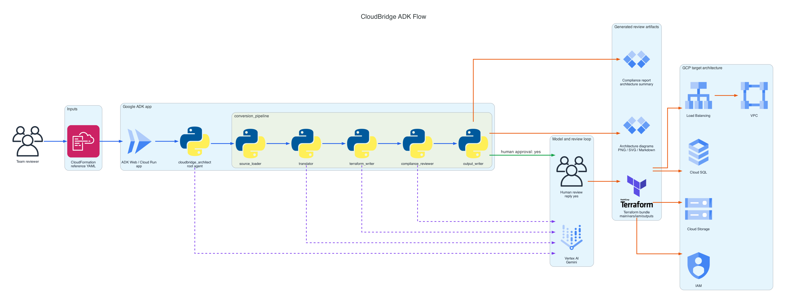

# CloudBridge

**Google ADK demo for turning AWS infrastructure standards into GCP-native Terraform, compliance review, and architecture diagrams**

CloudBridge is a showcase project for explaining how a small Google ADK agent workflow can help a team reason about AWS infrastructure patterns and produce a first-pass Google Cloud implementation for human review. The point is not blind conversion. The point is standards transfer.

## The Problem

Teams often have useful AWS CloudFormation templates that encode years of infrastructure standards: private networking, IAM boundaries, storage posture, database protections, naming patterns, and security review expectations. When a new application is going to run on Google Cloud, the goal is usually not to copy AWS line by line. The goal is to preserve the intent and standards while building a GCP-native architecture.

Doing that manually is slow, and doing it with a single prompt can be hard to review. CloudBridge breaks the work into a visible workflow:

| Need | CloudBridge response |
|---|---|
| Understand the AWS template | Parse and summarize supported CloudFormation resources. |
| Explain the GCP direction | Produce a readable AWS-to-GCP architecture mapping. |
| Draft implementation files | Generate starter Terraform for review. |
| Keep security visible | Report source risks, remediations, and residual review items. |
| Avoid silent writes | Require explicit human approval before writing output files. |
| Make the architecture easy to discuss | Generate diagrams from sample inputs and reviewed artifacts. |

This is not a production migration engine. It is a demo-friendly review workflow that makes the moving parts easy to inspect.

## What This Repo Does

CloudBridge provides four things:

| Capability | Where to look |
|---|---|
| Conversational ADK app | `app/agent.py` |
| Safe file and approval tools | `app/cloudbridge_tools.py` |
| Sample AWS CloudFormation inputs | `input/*.yaml` |
| Diagram generators | `scripts/generate_diagrams.py`, `scripts/generate_readme_adk_diagram.py`, `app/diagram_pipeline.py` |

The default demo flow is:

| Step | What happens |
|---|---|
| 1. Talk first | The root agent greets the user and can list or read project files. |
| 2. Convert only on request | The conversion pipeline runs only when the user asks to convert or generate a GCP bundle. |
| 3. Review before writing | Terraform and reports are staged first. The user must reply `yes`. |
| 4. Write and verify | Approved files are written under `output/`, diagrams are generated, and artifacts are verified. |
| 5. Reset easily | Generated outputs are ignored by git and can be removed with `make clean-output`. |

## Architecture At A Glance



The README uses the PNG version because the SVG renderer from `diagrams` may not embed provider icons reliably in GitHub previews.

Regenerate the diagram with:

```bash
make readme-diagram
```

Graphviz must be installed first because Diagrams uses it for rendering. On macOS:

```bash
brew install graphviz
```

The generator follows the Diagrams [installation](https://diagrams.mingrammer.com/docs/getting-started/installation), [diagram guide](https://diagrams.mingrammer.com/docs/guides/diagram), and [GCP node list](https://diagrams.mingrammer.com/docs/nodes/gcp). It uses provider nodes for AWS CloudFormation, Google ADK deployment on Cloud Run, Vertex AI/Gemini, Terraform, and target GCP services.

## Diagram To Code Map

Use this table when walking someone through the diagram. Every major diagram element maps to a concrete place in the repo.

| Diagram element | What it means | Code or artifact |
|---|---|---|
| Team reviewer | The person driving the ADK Web conversation and approving writes. | Human-in-the-loop behavior is enforced by `app/cloudbridge_tools.py::stage_output_package` and `app/cloudbridge_tools.py::commit_staged_output_package`. |
| CloudFormation reference YAML | AWS source template or standards reference. | Demo templates live in `input/*.yaml`; parser helper is `app/parser.py::parse_cfn`. |
| ADK Web / Cloud Run app | The running Google ADK app selected from the `app` folder. | `app/agent.py::app`, `app/agent.py::root_agent`, `Makefile::playground`, `Makefile::deploy`. |
| `cloudbridge_architect` root agent | Conversational coordinator. It answers simple questions, reads files, and delegates conversion only when requested. | `app/agent.py::root_agent`. |
| `conversion_pipeline` | Sequential ADK workflow for the conversion task. | `app/agent.py::conversion_pipeline`. |
| `source_loader` | Reads the selected CloudFormation input. | `app/agent.py::source_loader`; tools from `app/cloudbridge_tools.py::list_project_files` and `app/cloudbridge_tools.py::read_project_file`. |
| `translator` | Produces the AWS-to-GCP architecture mapping and calls out source risks. | `app/agent.py::translator`. |
| `terraform_writer` | Drafts `main.tf`, `variables.tf`, `iam.tf`, and `outputs.tf` fenced blocks. | `app/agent.py::terraform_writer`; deterministic fallback helper is `app/terraform_gen.py::generate_terraform`. |
| `compliance_reviewer` | Reviews source risks, generated Terraform, remediations, and residual review items. | `app/agent.py::compliance_reviewer`; deterministic helper is `app/compliance.py::compliance_check`. |
| `output_writer` | Stages generated files and asks the user to reply `yes`. | `app/agent.py::output_writer`; staging logic is `app/cloudbridge_tools.py::stage_output_package`. |
| Human review: `yes` | Explicit approval checkpoint before file writes and diagram generation. | `app/cloudbridge_tools.py::commit_staged_output_package`. |
| Vertex AI / Gemini | Model backend used by the ADK agents. | `app/agent.py::MODEL`, `app/agent.py::_vertex_model_name`. |
| Terraform bundle | Reviewable starter Terraform emitted by the writer. | Written to `output/main.tf`, `output/variables.tf`, `output/iam.tf`, `output/outputs.tf` after approval. |
| Compliance report and architecture summary | Review packet explaining what changed and what still needs validation. | Built by `app/cloudbridge_tools.py::_prepare_generated_output_files`; written to `output/compliance_report.md` and `output/architecture_summary.md`. |
| Architecture diagrams | Generated AWS, GCP, and conversion diagrams for visual review. | `app/cloudbridge_tools.py::generate_architecture_diagrams`; script implementation in `scripts/generate_diagrams.py`. |
| GCP target services | The target architecture represented by generated Terraform. | `app/terraform_gen.py::generate_terraform` and the LLM output from `terraform_writer`. |

## Future Product Direction

The strongest product direction is not "convert AWS to GCP." The stronger product is an infrastructure standards assistant: it learns from approved internal patterns, helps teams start new GCP applications correctly, and produces review artifacts that platform, security, and app teams can all understand.

The first wedge is simple: make it dramatically faster for a new application team to ask, "What should the GCP version of our standard architecture look like?" and get a reviewable answer with Terraform, diagrams, and risk notes.

| Future use | Who benefits | Why it could matter |
|---|---|---|
| Golden-path GCP starter | Application teams | A team describes a new app, and CloudBridge generates a GCP-native Terraform starter that follows internal standards from day one. |
| Architecture review copilot | Architects and platform leads | Before implementation, teams get a readable architecture plan, risk summary, and diagram packet for review. |
| Standards transfer tool | Cloud platform teams | Existing AWS templates become examples of policy intent, not migration targets. CloudBridge extracts the standards and applies them to new GCP builds. |
| Security pre-review | Security and compliance teams | Reviewers get early signals on public exposure, IAM breadth, database posture, storage controls, and missing review items. |
| Platform enablement demo | Internal developer platform teams | Approved patterns can be shown as working code, diagrams, and review notes instead of static wiki pages. |
| Portfolio triage | Engineering leadership | Given many templates, CloudBridge could classify patterns, unsupported services, risk hotspots, and likely GCP landing zones. |
| Compliance evidence packet | Governance teams | Each generated design could include the architecture summary, control mapping, diagram set, and approval record needed for review. |
| Training and onboarding | New engineers | Engineers can learn how the organization expects AWS patterns to map to GCP patterns through examples they can run. |

The practical product path should stay intentionally small:

| Phase | Product outcome |
|---|---|
| Now | Demo a safe, human-approved ADK workflow with Terraform, compliance notes, and diagrams. |
| Next | Add richer standards annotations, better deterministic checks, and clearer review packets. |
| Later | Build a reusable internal catalog of approved patterns, controls, and GCP landing-zone recommendations. |

The trap to avoid is pretending this is an automatic production migration system. The useful product is a fast, explainable starting point that makes the right review conversation happen earlier.

## 5-Minute Team Showcase

From a clean checkout, this is the fastest path to show the project:

```bash
make install
make test
make lint
make demo-diagrams
make playground
```

In ADK Web, select the `app` folder and use this script:

```text
hi
list input files
convert input/sample-three-tier-insecure.yaml to a GCP bundle
yes
```

What to show during the demo:

| Moment | Why it matters |
|---|---|
| Say `hi` first | Shows the root agent is conversational and does not run conversion immediately. |
| Ask `list input files` | Shows the agent can inspect safe project areas. |
| Convert the insecure sample | Shows a realistic source template with public database, broad network, IAM, and storage risks. |
| Review the compliance output | Shows the difference between source risk and GCP remediation. |
| Reply `yes` | Shows human approval before writing files. |
| Open `output/` | Shows generated Terraform, reports, and diagrams. |

Reset generated artifacts after a demo:

```bash
make clean-output
```

## Installation

Install Python dependencies with `uv`:

```bash
make install
```

Install Graphviz if you want PNG/SVG diagrams:

```bash
brew install graphviz
```

Set or confirm your Google Cloud project:

```bash
gcloud config set project YOUR_PROJECT_ID
```

Start the ADK playground:

```bash
make playground
```

`make playground` runs ADK Web with:

| Environment variable | Value |
|---|---|
| `GOOGLE_GENAI_USE_VERTEXAI` | `true` |
| `GOOGLE_CLOUD_LOCATION` | `global` |
| `GOOGLE_CLOUD_PROJECT` | Your configured or exported project ID |

## Sample Inputs

The demo templates live in `input/`.

| Input | Architecture pattern |
|---|---|
| `sample-three-tier.yaml` | VPC, subnets, EC2 or LaunchTemplate, RDS PostgreSQL, S3, IAM |
| `sample-three-tier-insecure.yaml` | Three-tier sample with intentional public DB, S3, IAM, and network risks |
| `static-site-cloudfront-s3.yaml` | CloudFront plus private S3 static website |
| `lambda-reverse-proxy.yaml` | API Gateway HTTP API plus Lambda reverse proxy |
| `serverless-event-pipeline.yaml` | S3 to SQS/DLQ to Lambda to DynamoDB event pipeline |

## Generated Outputs

`output/` is generated-only. The repo tracks `output/.gitkeep` so the folder exists, but generated files are ignored by git.

| Generated file | Created by |
|---|---|
| `output/main.tf` | `output_writer` after approval |
| `output/variables.tf` | `output_writer` after approval |
| `output/iam.tf` | `output_writer` after approval |
| `output/outputs.tf` | `output_writer` after approval |
| `output/architecture_summary.md` | `output_writer` after approval |
| `output/compliance_report.md` | `output_writer` after approval |
| `output/diagrams/*` | `scripts/generate_diagrams.py` or `commit_staged_output_package` |

## Diagram Options

CloudBridge has two diagram paths.

| Diagram path | Command | Purpose |
|---|---|---|
| README ADK flow | `make readme-diagram` | Regenerates the committed diagram used in this README. |
| Demo input diagrams | `make demo-diagrams` | Generates AWS source, GCP target, and conversion diagrams for all sample inputs under `output/diagrams/`. |
| One input diagram | `uv run --with diagrams python scripts/generate_diagrams.py input/lambda-reverse-proxy.yaml` | Generates diagrams for a single CloudFormation template. |
| Post-approval standards package | `uv run --with diagrams python -m app.diagram_pipeline --aws-reference path/to/aws --gcp-terraform path/to/tf --out output/diagrams --approved` | Generates manifests, Mermaid Markdown, PNG, and SVG artifacts from reviewed infrastructure. |

For more detail on the post-approval manifest path, see `docs/diagram_pipeline.md`.

## Compliance Review

The compliance report is designed to be more useful than a one-word pass/fail result.

| Status | Meaning |
|---|---|
| `PASS` | No meaningful source risks and generated Terraform is clean. |
| `PASS WITH REMEDIATIONS` | The AWS source had risks, but generated GCP Terraform mitigates them. |
| `NEEDS REVIEW` | Terraform is mostly safe, but assumptions require human validation. |
| `FAIL` | Generated Terraform still contains a high-risk issue. |

The reviewer focuses on public databases, public buckets, open network rules, broad IAM, storage protection, database backups, private IP, and deletion protection.

## Repository Guide

| Path | Role |
|---|---|
| `app/agent.py` | ADK root agent, conversion pipeline, specialist agents, and Agent Engine app export. |
| `app/cloudbridge_tools.py` | Safe file reads, approval staging, output writes, diagram generation, artifact verification. |
| `app/parser.py` | Deterministic CloudFormation parser used by tests and fallback helpers. |
| `app/terraform_gen.py` | Deterministic starter Terraform helper used by tests and fallback conversion. |
| `app/compliance.py` | Deterministic Terraform compliance helper. |
| `app/diagram_pipeline.py` | Post-approval standards manifest and diagram package. |
| `scripts/generate_diagrams.py` | Sample input AWS/GCP/conversion diagram generator. |
| `scripts/generate_readme_adk_diagram.py` | README ADK architecture diagram generator. |
| `tests/unit/` | Unit tests for parser, generation, compliance, approvals, and diagram pipeline. |
| `tests/integration/` | Import and Agent Engine integration checks. |

## Checks

Run tests:

```bash
make test
```

Run lint, formatting check, type check, and codespell:

```bash
make lint
```

## Deploy

The project keeps the Agent Starter Pack shape:

| Export | Purpose |
|---|---|
| `app/agent.py::root_agent` | ADK root agent. |
| `app/agent.py::app` | `google.adk.apps.App` for local and Agent Engine usage. |
| `app/agent_engine_app.py` | Agent Engine wrapper. |

Deploy when your Google Cloud environment is ready:

```bash
make deploy
```

## Notes

- Generated outputs are intentionally ignored by git.
- The README diagram is committed as PNG so the provider icons render reliably.
- `DSPY_STANDARDS_TRANSFER.md` explains how DSPy could later help evaluate and optimize standards transfer, but DSPy is not required for the current demo.
